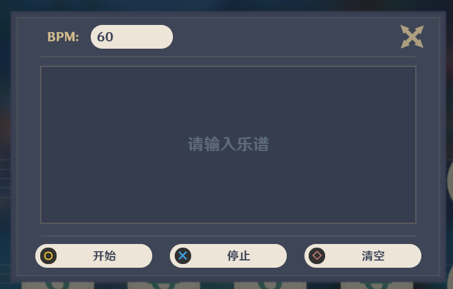

# 原神风物之诗琴模拟器

本网页可以模拟原神风物之诗琴，便于未能获取风物之诗琴的旅行者尝试弹奏。

## 操作

使用键盘上的字母按键来进行弹奏。

## 自动弹奏

点击右上角的按钮可以打开自动弹奏窗口。在该窗口内，可以设置BPM和乐谱。

-------
## 关于本地文件的说明

如果直接在本地打开index.html文件，因为浏览器的资源请求限制，本网页将会进入兼容模式，因此相比在线版会缺少一些功能：
* 同一个音在未完成播放时再次弹奏将会直接被截断
* 音频压缩器不可用
* 转调功能失效

以上问题可通过本地自建HTTP服务器来解决。